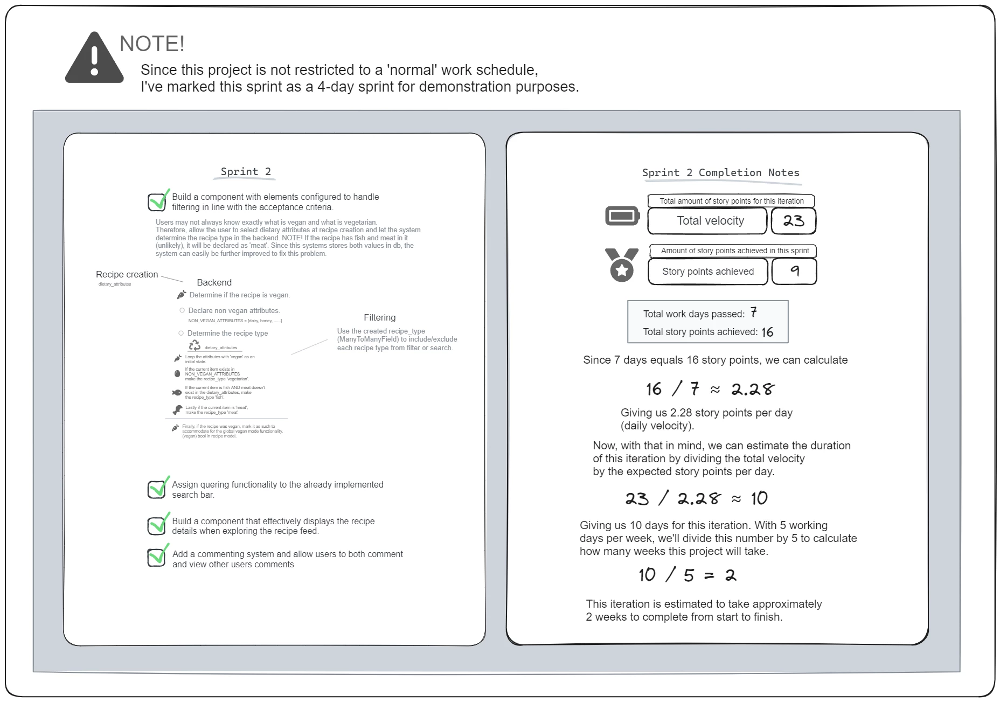

<link rel="stylesheet" type="text/css" media="all" href="static/css/readme.css" />

# Bottle Post Recipes

Click [here](https://bottle-post-recipes-eb1abd9c13ee.herokuapp.com/) 
to explore the live app! 🔥


## Quick tip!

If you've cloned this project, you can view this readme file with
<span class="em">customized</span> 
styling. 

Here's how to do it in VS Code:
1. Right-click on `README.md`
2. Select `Open Preview`
3. (Optional) You can change the text color and/or enahnce styling by editing the contents of `readme.css` (found in `static/css`). 

## Table of contents

- 🍃 [Introduction](#introduction)
- 🎨 [UX](#ux)
- 📉 [Agile](#agile)
- ⚙️ [Testing](#testing)
- 🛠️ [Technologies](#technologies)
- 🖥️ [Databases](#databases)
- 🌳 [Credits](#credits)
- 🏕️ [Environment variables](#environment-variables)
- ☁️ [Deployment with Github Actions](#deployment-with-github-actions)

## Introduction

Have you ever released a bottled message in the ocean? 🌊

This is an old concept, and while it may seem inviting, it's not environmentally friendly. This web app mimics that idea but for recipes and without littering the ocean! 

The goal is to empower the DIY era and create an archive of recipes crafted by the people. Do you have a talent for cooking and feel the desire to share it to the world? Bottle up your recipe, post it on 
<span class="em">Bottle Post Recipes</span>, and it might arrive on someone's digital shore. Yes, whenever you publish a recipe, there's a chance it will appear as a notification to any user! This is how this web app stands out, it leverages the power of sharing while filtering signal from noise. Recipes are algorithmically boosted **based on their quality**, not the creator's ability to reach. Say goodbye to **networking skills** and say hello to **delicious, high-quality recipes!**

#### Mission 🗻

In today's age, it is common for social media influencers to use 'unapproved' strategies to increase their reach on the web. These influencers are buying followers, likes, and comments to boost their social media presence. This app is determined to tackle these problems with a concept inspired by the famous <span class="em">bottle post</span>.

#### How it works 🔨

At <span class="em">Bottle Post Recipes</span>, the most powerful metric for boosting a post is the number of times it's been returned to the 'ocean'. Below is a step-by-step explanation of how it works.

1. **A user visits the app and receives a recipe**

If all conditions are met, the algorithm will authorize and notify the user to review a random recipe that currently exist 'in the ocean'🌊.   

2. **The user reviews the recipe.**

There are <span class="em">two</span> choices:

> 🌊 **Return the recipe to 'the ocean'**   
> This action boosts the recipe's visibility, allowing other users to continue boosting it in turns. 

> ❌ **Remove the recipe from 'the ocean'**  
> Other users will no longer be able to review this recipe.

At this point, the user will be locked out from this feature for **24 hours** to prevent algorithm abuse.

#### Why it works 🤷‍♂️

For example, on other social platforms, a person can alert 30 of their friends and tell them to engage with their post imediatelly, thus increasing the chances of boosting its visibility to other users. This won't work at <span class="em">Bottle Post Recipes</span> because all 30 people would need to be randomly picked by server-side calculations, which is very unlikely.

> ⚠️ **NOTE**  
> This is an MVP project, and the system is far from perfect. 
> For example, users can return the same recipes to the ocean multiple times. This needs to be addressed, especially when users and recipes are not that many. 

#### Finishing up 💪

Since the app determines who can boost which recipe, it keeps cheating users (and even robots) at bay, **literally**. Remember, users have the power to both boost recipes and **delete them forever** (from the ocean). This not only makes this app perhaps the most influential platform you've ever heard of, but it can also empower users to feel like they're in control of the algorithm and capable of making a difference.
  
> ❕ **Future update**  
> Polls may be introduced to give some recipes an extra chance. Perhaps a few 'non-ocean' recipes per month could be sent out randomly to have another chance to enter the ocean again. 

## Features ⭐️

Here's a more detailed look at the features of this app. 

#### Vegan mode 🍏


A concerted effort has been dedicated to make this app a vegan-friendly app. Some people don't want to see animal products when they start the computer, and all systems in the Bottle Post Recipes app are designed to filter out such recipes right away. The orange <span class="em" style="color: var(--orange)">Vegan Button</span> is not just a button, it's a mark on your profile. If you disable vegan mode, it will stay disabled even if you refresh your browser. This setting is extremely easy to toggle and it's a great way to let everyone feel welcome. If you don't like vegan recipes, you can even filter them out entirely. It's worth noting that when vegan mode is turned on, it will overwrite any other settings.

> ⛔️ **KNOWN ISSUE**  
> Users with vegan mode enabled can be asked to review a non-vegan recipe. The non-vegan recipe won't be shown until or if the user disables vegan mode. A fix for this should be prioritized, as it goes against the intent of the app. It may also cause vegans to downrate non-vegan recipes that others might enjoy.

#### Viewing recipes 👀

To view a recipe's details, simply click on the recipe image in the main view. This will display all details related to the recipe at hand.

> ⛔️ **KNOWN ISSUE**  
> When scrolling in the recipe viewer pop-up, it may also scroll the main view behind the recipe viewer.


#### Searching and filtering recipes 🔍

As mentioned, users are able to search for recipes in a highly sophisticated way. If you want vegetarian or meat recipes but no fish, it's as easy as clicking on a couple of buttons. Perhaps title searching isn't enough? At Bottle Post Recipes, you can find recipes based on their ingredients, description, title, and tags, all customizable to help you narrow down your search results.

#### User-based search 👤

User-based search isn't fully implemented but you can click on users and display their recipes. If you want to view all the recipes that you've created, you can do so by clicking **My Recipes** in the **Account Button** dropdown.

#### Create recipe 🧾

If you ever want to become a chef at Bottle Post Recipes, it's as easy as posting on social media! Click on the big ➕ button at the bottom left, fill out the form, and your recipe will be bottled up and dropped into the ocean immediately! A spamming filter is integrated and users are allowed to post **1 recipe per day**.

#### Edit or delete recipe 🖊️

A fully fledged recipe editor is integrated and easily accessible in the main view. You can open this by clicking the edit button located at the right side of each recipe. After clicking on the edit button, a pop-up window will appear, displaying your recipe in a more comprehensive view with editable fields. All fields are pre-populated and remain as they were when you last edited your recipe.

#### Commenting 🗯️

There's a BETA commenting system you can engage with when viewing a recipe.

> ⛔️ **KNOWN ISSUES**  
> 1. When posting a comment, it should appear immediately. However, the comment that appears is simulated (not read from db), this is to avoid re-fetching and breaking the UI. When closing the recipe view, this simulated comment will be cleared. This means that if you open that recipe again (without refreshing your browser), the comment will appear to be erased. It should however be written to the database and loaded after a browser refresh. 
>  
> 2.  The latest comments are loaded top-down which breaks the pattern of 'normal' comment sections on the web. 

#### Bottle post system ♻️

This has already been explained in the [introduction](#introduction). When using the app, you will be asked to review recipes that exists in 'the ocean' on a daily basis.

> ⛔️ **KNOWN ISSUES**  
> 1. **SEVERE!** Hghlighted recipes that users are allowed to review may get 'stuck'. It may appear as the already reviewed recipe can be reviewed again. The back-end will block any unauthorized user actions if the user does submit the review again. This is a catche issue that needs to be fixed ASAP.    
>  
> 2. If there are no recipes in the ocean, it may be confusing when reviews nevers gets handed out. Some type of message should be displayed here.
>  
> 3. When there are few users and recipes, this feature can give early users a massively unfair advantage.The number of users and recipes should be factored into the calculation of how many recipes can be reviewed per day.
>  
> 4. Users are able to return the same recipe to the ocean more than one time. This is a problem for the algorithm, especially when there aren't that many recipes. 
>  
> 5. Users are able to boost their own recipes. Again, when there's not that many recipes, chances are high that new users will take advantage of this fluke.  
>  
> 6. If a recipe has had their recipe retunred to the ocean more and 100 times, it may break the UI.


#### Delete account ❌

To comply with privacy laws and to provide a seamless way to allow users to delete their data. A **Delete Account** button is located at the **Account Button** dropdown. This is designed in such a way that it also deletes related data in the database. Users are therefore able to purge their data from the system meaning recipes, comments, username, etc. 

> ⛔️ **KNOWN ISSUE**  
> As of right now, images uploaded with cloudinary (third-party) won't be automatically deleted. This should be integrated ASAP. 

## UX-Design

### Initial design 🎨

This app's design was initially composed with the help of illustrations and vector editing, to understand of how the components could coexist.


### Thought process 💭

According to [this article](https://medium.com/@hayavuk/ui-ux-design-fundamentals-for-the-front-end-developers-688ba43eaed4) written by [Hajime Yamasaki Vukelic](https://medium.com/@hayavuk), the most important content should be placed front and center but more towards the top. This follows widely recognized patterns seen on famous platforms such as [YouTube](https://youtube.com/), [Google](https://google.com/), and just about any social media platform. Therefore, in this app, the recipes are placed accordingly. This is thought to draw the users' immediate attention to the app's most important content.

##### Consistency, color scheme, and sizing

The illustrations follows a 'universal design' and elements throughout the app are in line with universally recognized patterns. Action buttons are marked with common icons (e.g., magnifying glass for search, heart for likes, etc.) and these elements are placed in areas familiar to many mainstream applications. If the user receives a notification, the famous red circle and white number appear, again 
in harmony with other popular apps.

Elements and texts are designed in different (but consistent) sizes to help guide the user. Titles are generally larger, clearly visible, placed conveniently, and aligned to the left to give the user a natural feel and flow of reading.

Colors are designed to provide a strong contrast and to make the main components of the app stand out. 

##### Keeping the user informed 

[Santhosh Adiga U](https://santhosh-adiga-u.medium.com/) wrote an interesting piece about 
[Jakob Nielsen](https://www.nngroup.com/people/jakob-nielsen/)'s idea about keeping the user informed 
([Source](https://santhosh-adiga-u.medium.com/jakob-nielsens-heuristics-for-interaction-design-guidelines-for-user-centered-excellence-609b270c7e6a)).
Users should be informed about the status of the system underneath the app. This concept has been followed when designing the 
<span class="em">Bottle post recipes</span>
. Without any navigation, the user can view the immediate app response of user actions when events such as toggling on/off states or receiving notifications happen. The app is also configured with loading spinners that further inform the user about the current status of the app.

##### Minimalistic design

A minimalistic design has been approached for this project due to a couple of reasons. 
1. To allow and leave room for further implementations.
2. To draw users' attention to the main contents of the app with minimal distractions.
3. To simplify the users' first impression of the app.

Furthermore, the layout is clean and uncluttered, ensuring that the user can interact and navigate efficiently.

## Agile

This project has been developed using an agile workflow. A full product backlog can be found
[here](https://docs.google.com/spreadsheets/d/1PeogB3eeDqFkOYAEEOrRHGEeLwsbEA2HacY5YU3jUWI/edit?usp=sharing).

")

### First iteration 🚀

#### Diagrams

All diagram images for this iteration were created and rendered using [Excalidraw](https://excalidraw.com/). A web app that allows users to create sketchy diagrams and projects perfect for situations like these. To view these diagrams more closely, you would want to download [this file](https://github.com/KevinBjarnemark/bottle-post-recipes/blob/main/diagrams.excalidraw) located in the root of this project's [GitHub repository](https://github.com/KevinBjarnemark/bottle-post-recipes). It should be as easy as dragging the [.excalidraw file](https://github.com/KevinBjarnemark/bottle-post-recipes/blob/main/diagrams.excalidraw) into the [Excalidraw](https://excalidraw.com/) web app, after downloading it.

#### Summary 

This project has only gone through a single iteration so far. Here's a quick summary:

- **Total velocity:** <span class="em">23 story points</span>
- **Story points achieved:** <span class="em">23</span>
- **Estimated time to complete:** <span class="em">10 days</span>

> ⚠️ **NOTE**  
> The duration of a typical sprint is usually 1-4 weeks and in this project, the sprints are structured to demonstrate the SCRUM methodology rather than adhering to standard sprint durations. 
> This project has been developed during a longer, flexible period outside of normal work hours, and the estimated time to implement features on a given sprint has been estimated fictitiously to better fit a regular, full-time schedule.

#### Sprints

Each sprint is documented separately below.

<details>
    <summary>
        Sprint 1
    </summary>

### User authentication, basic recipe creation & sensitive content

- **Duration:** <span class="em">3 Days</span>
- **Story points:** <span class="em">7</span>

#### Goals

- Implement user sign-up and login functionality
- Create a basic recipe creation form
- Display the list of created recipes
- Allow users to toggle a vegan mode to include sensitive viewers

#### Achievements 🏆

**Story points completed:** <span class="em">7</span>


> ✅ **Implemented user sign-up and login functionality**  
> Added additional layers such as profile image uploads.

> ✅ **Created a basic recipe creation form**  
> Implemented a JavaScript system that interacts with data inherited from Django models.

> ✅ **Displayed the list of created recipes**  

> ✅ **Allowed users to toggle a vegan mode to include sensitive viewers.**  
> This system will hide all recipes until the JavaScript has executed. This, to avoid non-vegan recipes to be shown quickly on page load.  

#### Retrospective

##### Result

Completed all planned story points and integrated some additional features.

##### Challenges 

It took some effort to figure out how to combine the power of JavaScript with backend for better user experience.

##### Next sprint 

Use and improve the already implemented systems for the upcoming tasks.  

##### Diagram 


</details>

<details>
    <summary>
        Sprint 2
    </summary>

### Recipe, search, filtering, viewing, and commenting

- **Duration:** <span class="em">4 Days</span>
- **Story points:** <span class="em">9</span>

#### Goals

- Recipes can be searched and filtered on the main feed.
- Recipe details can be viewed from the main feed.
- Users are able to comment on recipes.

**🏆 Achievements:**

**Story points completed:** <span class="em">9</span>

> ✅ **Recipes can be searched and filtered on the main feed**  
> Integrated filters for recipe types: vegan, vegetarian, fish, and meat.  
> NOTE! If a recipe has both fish and meat in it (unlikely), it will be labeled as 'meat'. The systems are designed so that this can be corrected in the future without requiring additional details from users.

> ✅ **Recipe details can be viewed from the main feed**  
> Added a component that loads recipes as a pop-up component.

> ✅ **Users are able to comment on recipes**  
> Added a comment section with very basic functionality and marked it with a beta label to inform users that it's not fully developed.  
> Newly added comments will be simulated to give the user an immediate response, as users would expect. Simulated comments will be removed from the recipe viewer component when the user closes the window. This is because the component needs to be cleared and ready to load other recipes. While they might appear as removed, they are written to the database and should appear after a browser refresh.

#### Retrospective

##### Result 

Completed all planned story points and fused new functionality with already implemented systems. Improved already implemented systems for better app continuity. A direction change was made in how to generate HTML form components for better readability and usability.

##### Challenges 

There were no real challenges and the already implemented systems facilitated this sprint nicely. 

##### Next sprint 

Consider a more dynamic system for displaying, editing, and creating recipes. It's worth considering combining these components into a single more comprehensive component. 

##### Diagram



</details>

<details>
    <summary>
        Sprint 3 (with iteration 1 summary)
    </summary>

### Reviewing and editing

- **Duration:** <span class="em">3 Days</span>
- **Story points:** <span class="em">7</span>

#### Goals

- Users are able to delete their own recipes securely.
- Users are able to display their own recipes separately, making it easier to edit them.
- Users are able to boost or downgrade other recipes. 

**🏆 Achievements:**

- **Story points completed:** <span class="em">7</span>

> ✅ **Users are able to delete their own recipes securely**  
> Added a security layer that forces the user to click 10 times the delete button to delete a recipe, to prevent accidental deletes.

> ✅ **Users are able to display their own recipes separately, making it easier to edit them**  
> Added a query filter that filters out all other recipes other than the current user. This query filter can be used for other purposes in future updates.

> ✅ **Users are able to boost or downgrade other recipes**  
> Added a time-based recipe review system. Users who haven't reviewed in 24 hours will get a recipe ID assigned to their user profile. This ID will not change when a user for example, refreshes the browser.  
> The system is not perfect and for example, users are able to boost their own recipes, which can be seen as unfair. Users can also boost (return a recipe to the ocean) more than once if they get the same recipe ID assigned to them. 

#### Retrospective

##### Result

- Completed all planned story points, improved code readability, structure, continuity, and security.
- Notes from the previous sprint suggested that there should be a more comprehensive system for editing, viewing, and creating recipes. This task has been tackled in this sprint by combining the recipe editor with the create recipe page. The create recipe page (app) has been deleted and embedded into the recipe editor, this enables users to both create and edit recipes in a single more unified system.

##### Challenges 

The work done in previous sprints acted as a strong foundational layer and the features in this sprint could therefore be implemented with ease.

##### Diagram


</details>

## Testing

In this chapter you'll find out more about how code testing has been approached in this project. Both manual and automatic testing with **`Jest`** and **`Pytest`** have been configured to catch problems before anything goes live.

### Manual testing

There are many ways you can run manual tests, but the most straightforward way to execute JavaScript-based tests might be to simply run **`npm test`** configured in [package.json](package.json). 

To run tests for Python, use `pytest`. This will find any .py file that either has `test_` in the beginning or `_test` in the end of its name.  

### Automatic testing

There are multiple ways to automate testing, in this chapter, we'll walk through some configurations used in the development of this project. 

#### GitHub Actions

With GitHub Actions configured you can automate testing inside the GitHub environment. In the development of this project, these types of tests are only executed on deploys. This is because testing is already automated locally with Git hooks in this case. 

> ⚠️ **NOTE**  
> When configuring a GitHub workflow, you need to permit GitHub to do the following:  
> 1. Execute read and write actions in GitHub Actions.  
> 2. Read and use your environment secrets.  

To create this setup, you'll need to configure a GitHub workflow by adding a [deploy.yml](.github/workflows/deploy.yml) file in `.github/workflows`. 

You also need to submit your environment secrets to GitHub.

1. Go to your repository
2. Click on settings
3. Click on `Actions` in the `Secrets and variables tab`.
4. Click on `Add new repository secret`. 

Now, if you've configured your [deploy.yml](.github/workflows/deploy.yml) similarly, you should be able to simply create a tag, and then deploy the project with a push.

Before proceeding, it's worth noting that you might want to push normally before deploying a new version. 

1. Create a tag
    - **`git tag v0.1`**
2. Push new version
    - **`git push origin v0.1`**

If everything works as expected, your automated tests will be running in the GitHub Actions environment. If all tests pass, your project should also be deployed to Heroko. More on that in [Deployment and Github Actions](#deployment-and-github-actions).

#### Git hooks locally (optional) ⭐️

> ⚠️ **NOTE**  
> This is a local setup **invisible** in the official GitHub repository!

If you want to enable automatic testing locally, you might want to configure a custom script that runs before any changes are pushed. This adds a layer to the development process that ensures that only tested code makes it to the remote repository, which can improve overall code quality and catch errors early.

##### Here's how to set it up

With the following setup, you'll be able to automatically run whichever tests you like before pushing to GitHub. The Git hook will terminate your `git push` command if any of your tests fail, and only push tested changes to your remote repository.

1. Create a `pre-push` file in your `.git` folder.
2. Configure your custom testing script, example below.

```bash
#!/bin/bash
echo "Running tests before pushing..."

# Activate virtual environment for Python
source venv/bin/activate

# Run pytest for Django tests
pytest
PYTHON_STATUS=$?

# Run Jest for JavaScript tests
npx jest
JS_STATUS=$?

# Check if any tests failed
if [ $PYTHON_STATUS -ne 0 ] || [ $JS_STATUS -ne 0 ]; then
    echo "Tests failed. Push aborted."
    exit 1
else
    echo "All tests passed! Proceeding with push."
    exit 0
fi
```

3. Make it executable by running **`chmod +x .git/hooks/pre-push`**

##### Will this force each developer to configure this individually?

Yes, but since this configuration rather enhances the developer's workflow, it's not necessarily a 'catch'. In this project, `GitHub Actions` are also configured for when the project is deployed, which ensures that only tested changes go live. Even if untested changes make it to the remote repository, they won't pass the deployment stage. This workflow is therefore a great way to give developers the freedom for a custom setup while sticking to the housing rules! 

## Technologies

Explore some of the technologies that have been utilized in the development of this project below. 

### Programming languages and frameworks

<details>
    <summary>
        Python
    </summary>

A dynamically and strongly typed programming language.

</details>

<details>
    <summary>
        JavaScript
    </summary>

Used for adding interactive behavior to the web pages and handling client-side logic.

</details>

<details>
    <summary>
        HTML
    </summary>

The standard markup language used for structuring the content on the web.

</details>

<details>
    <summary>
        CSS
    </summary>

Used for styling the HTML elements. 

</details>

<details>
    <summary>
        Bootstrap
    </summary>

A popular front-end framework for developing responsive and mobile-first websites using HTML, CSS, and JavaScript.

</details>

<details>
    <summary>
        Django
    </summary>

A free and open source Python web framework that encourages rapid development.

</details>

### Third party packages

#### NPM Packages 

<details>
    <summary>
        Babel
    </summary>

#### babel/core

A compiler used to transform ES6+ JavaScript into a backwards-compatible version. 

#### babel-jest

A Jest transformer that allows Babel to trinspile the code during testing. 

</details>

<details>
    <summary>
        JEST
    </summary>

JEST is a library that allows developers to design and execute tests for JavaScript code, including unit tests, integration tests, and more.

</details>

<details>
    <summary>
        Dj Database Url
    </summary>

A utility that allows you to configure A Django database using a URL to simpify database configuration in different environments.

</details>

#### Python packages

<details>
    <summary>
        PyTest
    </summary>

PyTest is a testing framework that allows developers to write simple and scalable tests in Python.

</details>

<details>
    <summary>
        Django browser reload
    </summary>

When DEBUG is **`True`**, [this](https://pypi.org/project/django-browser-reload/)  package will automatically reload the page when static assets or templates are modified.

</details>

<details>
    <summary>
        Flake 8
    </summary>

This package helps with linting in Python, see [this](.flake8) file to view configuration. 

</details>

<details>
    <summary>
        Cloudinary
    </summary>

[Cloudinary](https://cloudinary.com/) is a free alternative that helps with hosting files. It has been used in this project to store recipe and user images.

</details>

### Deployment


<details>
    <summary>
        Heroku
    </summary>

A platform that enables developers to build, run and operate applications entirely in the cloud.

</details>

## Databases

The app is integrated with three databases. 

- Testing database
- PostgreSQL database (development)
- PostgreSQL database (production)

This confguration enables safe data manipulation without touching any real users' data. 

### Models

Here's an organized 
[Google Drive folder](https://drive.google.com/drive/folders/1XI6bcvofHK3coOBKf5o2hF7HKXSjMe5f?usp=sharing)
with all models used in this app. 


## Credits

You can find details about some of the third parties that we've used in the technologies section. Explore the third party sources that hasn't been established elsewhere in this document below. 

### [Google fonts](https://fonts.google.com/)

- [Luckiest Guy](https://fonts.google.com/specimen/Luckiest+Guy)
- [Tilt Neon](https://fonts.google.com/specimen/Tilt+Neon)
- [Lilita One](https://fonts.google.com/specimen/Lilita+One) 

## Environment variables

Here we'll go over how environment variables are configured and how the development environment differs from production.

To mimic the Bottle post Recipes setup, you'll need to configure your environments accordingly.

<details>
    <summary>
        HEROKU_API_KEY
    </summary>

On the Heroku's website, you can find this API Key in your account settings. Make sure to add it to your GitHub repository.

1. Go to **Settings**.
2. Click on **Secrets and variables**
3. Click on **Actions**
4. Add a new secret with the name `HEROKU_API_KEY` and paste the key as the value.


#### NOTE!

This shouldn't be added to your local `.env` file. GitHub needs this API key for deploying with GitHub Actions.

</details>

<details>
    <summary>
        DEVELOPMENT_DATABASE
    </summary>

#### SECURITY NOTE!

Never deploy your app with this set to **`True`**, as that would give users access to your development database! You can access the production database (NOT RECOMMENDED) locally by setting this to **`False`**. It is crucial to note that this variable is your 'database guard' and regardless of its value, it will be **`False`** in production (if configured correctly). There are security warnings in the source code that prevents any developer from editing if statements that rely on this variable.

#### Development 

- **`True`**

#### Production 

- **`False`**

</details>

<details>
    <summary>
        DJANGO_SECRET_KEY
    </summary>

#### Development 

- `YOUR DJANGO SECRET KEY`

#### Production 

- `YOUR DJANGO SECRET KEY`

</details>

<details>
    <summary>
        DJANGO_DEBUG
    </summary>

#### SECURITY NOTE!

Never set this to **`True`** in production in any circumstances!

#### Development 

- **`True`**

#### Production 

- **`False`**

</details>

<details>
    <summary>
        DATABASE_URL
    </summary>

#### Development 

- `YOUR PRODUCTION DATABASE URL`

#### Production 

- `YOUR PRODUCTION DATABASE URL`

</details>

<details>
    <summary>
        DEVELOPMENT_DATABASE_URL
    </summary>

#### Development 

- `YOUR DEVELOPMENT DATABASE URL`

#### Production 

- **`NONE OR UNSET`**

**Note**

This project is using the dj-database-url package, you can follow 
[this](https://pypi.org/project/dj-database-url/) 
link if you're unsure how to format your database URL.

</details>

<details>
    <summary>
        CLOUDINARY_URL
    </summary>

#### Development 

- `YOUR CLOUDINARY URL`

#### Production 

- **`NONE OR UNSET`**

**Note**

This is only used in production. Locally, static files are 'uploaded' into the media folder. 

</details>

## Deployment with Github Actions

Heroku is a service that allows seamless integration with GitHub, and it has been used throughout this app's development. As already explained in the [testing chapter](#testing), the deployment process is in harmony with the automatic testing workflow. Again, GitHub Actions has been utilized to deploy this project, and the script for deploying with automatic testing is located [here](.github/workflows/deploy.yml).

The automatic test-and-deploy script will only fire when the project is pushed with a tag. Which enables cloud version control without deploying on every push. The required steps have already been explained [here](#automatic-testing).

## Cloning the repository 🧬

To explore, develop, or experiment with Bottle Post Recipes, you can clone this repository to create your own local copy. Cloning allows you to contribute, test out new features, or modify the project in your own space.

#### Steps to clone

Before cloning, ensure you have [Git](https://git-scm.com/) installed on your system.

1. Navigate to the repository on GitHub.
2. Click on the green Code button.
3. Copy the repository URL (choose HTTPS, SSH, or GitHub CLI as preferred).
4. Open your terminal or command line and type

```bash
git clone <repository-url>
```

5. Navigate into the project directory:
```bash
cd bottle-post-recipes
```

## Forking the repository 🍴

Forking is your gateway to personalizing Bottle Post Recipes and proposing changes. By forking, you create your own version of the repository under your GitHub account.

#### Steps to fork

1. Navigate to the repository on GitHub.
2. Click on the Fork button at the top right corner of the page.
3. The repository is now available in your GitHub account.
4. Clone your forked version using the cloning steps outlined above.

Once you've forked and cloned, feel free to explore and enhance the project! Check out the [README.md](README.md) for guidance on running the project locally.

